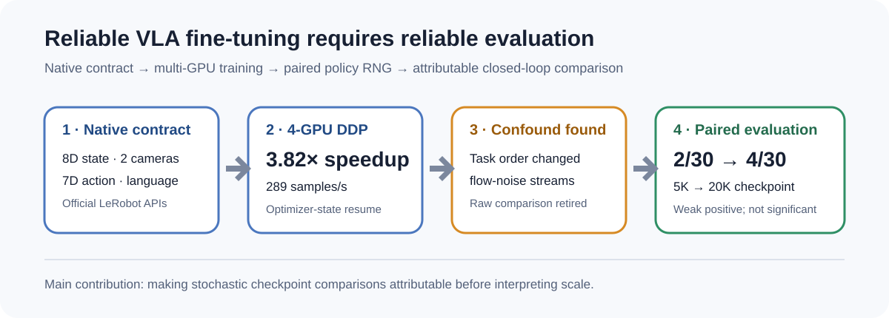
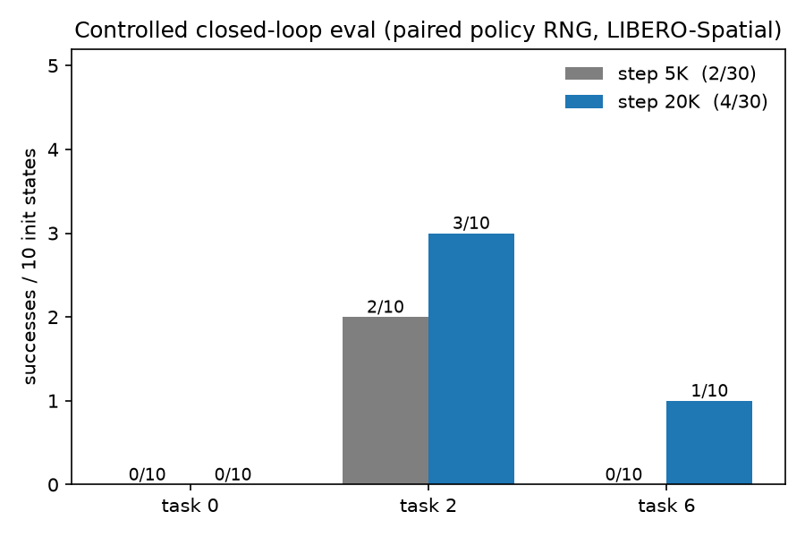

# Reliable Multi-GPU VLA Fine-Tuning and Evaluation on LIBERO

An end-to-end SmolVLA study covering native data-contract validation, 4-GPU
training, official closed-loop evaluation, and a controlled investigation of
why lower training loss did not translate into reliable task success.

## Why this matters

Evaluating a stochastic robot policy is not just a matter of running more
episodes. If two checkpoints see different initial states or consume different
action-noise streams, an apparent improvement can come from the evaluator
rather than the model.

This project found exactly that failure mode in an initial SmolVLA checkpoint
comparison. I traced it to flow-matching noise sampled with `torch.normal`,
then rebuilt the evaluation so each checkpoint receives the same LIBERO state
and the same per-episode policy RNG stream. That correction reversed the
direction of the original scaling conclusion.

## Results at a glance

| Evidence                           |                                         Result |
| ---------------------------------- | ---------------------------------------------: |
| 4×RTX 4090 DDP scaling             |   **3.82×** vs. 1 GPU at matched per-GPU batch |
| Formal training data               | **1,693 episodes / 273,465 frames / 40 tasks** |
| Training loss, 5K → 20K            |                              **0.665 → 0.535** |
| RNG-controlled closed-loop success |                                **2/30 → 4/30** |

The controlled result is a weak positive training-scale signal, not a claim of
statistical significance or solved LIBERO performance. Its value is that the
comparison is now attributable to checkpoint weights rather than task order or
uncontrolled policy noise.

## What I built

- A native LIBERO/SmolVLA training path using the official LeRobot v0.6.0
  dataset, processor, model, loss, and evaluator APIs.
- A 4-GPU `torchrun`/DDP pipeline with bf16, distributed sampling,
  self-contained checkpoints, optimizer-state resume, and throughput/VRAM
  measurement.
- Official closed-loop evaluation using LIBERO initialization states and
  success predicates, plus action-horizon and checkpoint studies.
- Per-episode paired RNG control across Python, NumPy, Torch, CUDA, and the
  flow-matching noise generator.
- Compact result artifacts and plots that preserve the evidence behind every
  claim in this README.

## Training and evaluation evidence

The formal DDP configuration used a global batch of 64 and reached 289.3
samples/s with about 5.1 GB VRAM per rank. The 5K run completed in 1,389 s; an
optimizer-state resume extended it to 20K without NaNs, stalls, or NCCL errors.

The initial full LIBERO-Spatial evaluation reached 4/100 success. More frequent
replanning did not rescue the selected task: executing 50, 10, or 5 actions per
chunk produced 3/10, 1/10, and 0/10 successes. This ruled out the default
50-action execution interval as the main bottleneck in that test.

The rollout timing trace is heavy-tailed: cached-action environment steps had a
4.3 ms p95, while a new 50-action chunk required about 0.28 s once per chunk;
the amortized mean was 8.6 ms per environment step. These numbers are reported
separately to avoid presenting the cached-action p95 as generation latency.

## The evaluation bug and the fix

The official evaluator seeds once per run. Because SmolVLA samples flow-matching
noise, changing task order changes which random draws each checkpoint receives.
The first cross-checkpoint comparison was therefore not paired.

The final protocol assigns a deterministic seed to every `(task, init_state)`
pair and supplies per-element `torch.Generator` instances to the flow-matching
sampler. The 5K and 20K checkpoints then receive identical environment starts
and policy-noise sequences. Under this protocol, 20K retained one prior success,
lost one, and gained three new successes.

## Scope and limitations

- This is simulator evidence; no physical robot was controlled.
- Final controlled evaluation contains 30 episodes per checkpoint and cannot
  resolve small effect sizes.
- Absolute success remains low. The project demonstrates a reliable training
  and evaluation workflow, not a high-performing LIBERO policy.
- The paired noise hook is an inference-time evaluation control, not a new VLA
  architecture or training algorithm.

## Repository guide

- [RESULTS.md](RESULTS.md) — milestone evidence and exact numerical results
- [INTERVIEW_GUIDE.md](INTERVIEW_GUIDE.md) — technical decisions and likely questions
- `src/` — DDP training, checkpointing, evaluation, and RNG-control code
- `results/` — compact JSON/CSV evidence
- `figures/` — training, scaling, controlled success, and transition plots

**Stack:** PyTorch 2.7.1, LeRobot v0.6.0, SmolVLA, LIBERO, MuJoCo/robosuite,
NCCL DDP, bf16, and 4×RTX 4090.
